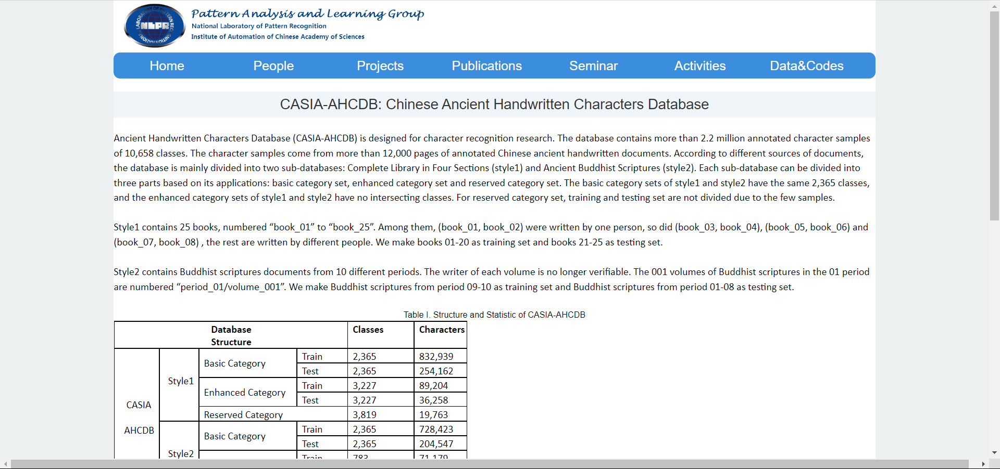
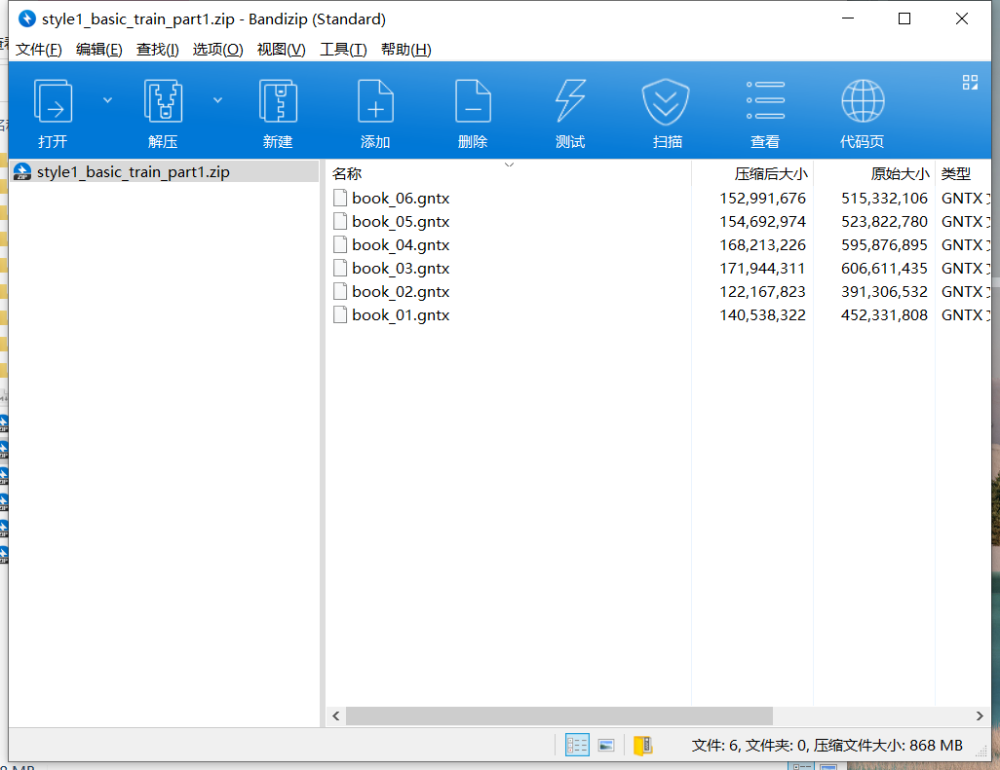
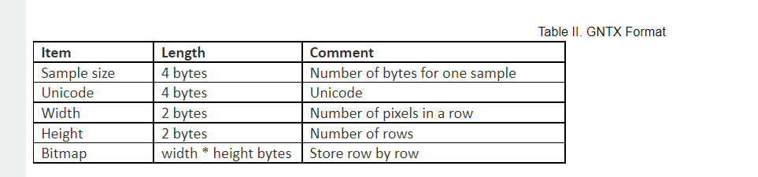
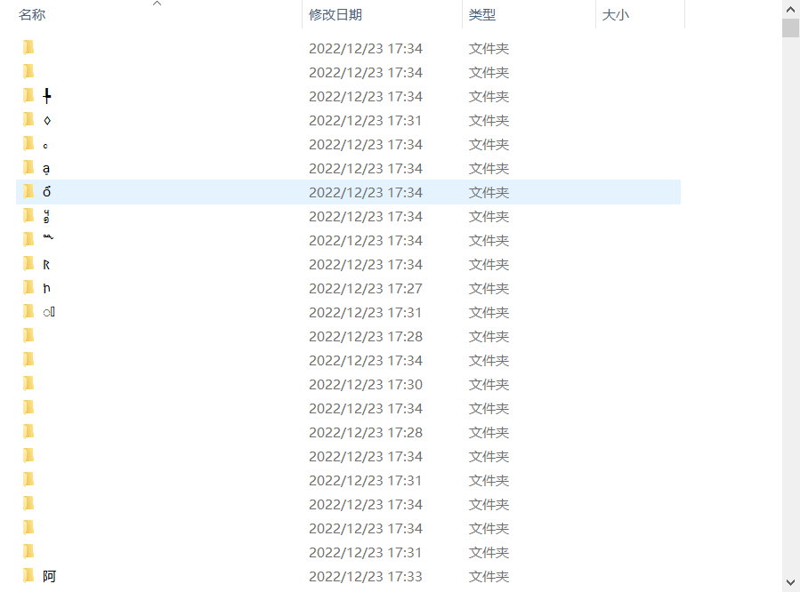

# CASIA-AHCDB-load
数据官网地址下载链接：
[http://www.nlpr.ia.ac.cn/pal/CASIA-AHCDB.html](http://www.nlpr.ia.ac.cn/pal/CASIA-AHCDB.html)



解压后的数据格式为.gtnx




代码：
将.gtnx后缀格式文件转化为png

```python
import os
import numpy as np
import struct
from PIL import Image
# data文件夹存放转换后的.png文件
data_dir = 'E:/data/CASIA-AHCDB'
# 路径为存放数据集解压后的.gntx文件
#train_data_dir = os.path.join('', 'E:\data\CASIA-AHCDB\style1_basic_train_part1')
train_data_dir = os.path.join('', 'E:\data\CASIA-AHCDB\style1_basic_test')
# test_data_dir = os.path.join('', 'E:/github/HWDB/HWDB1.1tst_gnt')


def read_from_gnt_dir(gnt_dir=train_data_dir):
    def one_file(f):
        #头大小为12
        header_size = 12
        while True:
            header = np.fromfile(f, dtype='uint8', count=header_size)
            if not header.size: break
            sample_size = header[0] + (header[1] << 8) + (header[2] << 16) + (header[3] << 24)
            #Unicode = header[7] + (header[6] << 24)+ (header[5] << 16)+ (header[4] << 8)
            # Unicode =  hex(header[5]).strip('0x') + hex(header[4]).strip('0x')
            # Unicode = '\\u' + Unicode
            # print(Unicode)
            Unicode = header[4] + (header[5] << 8)
            width = header[8] + (header[9] << 8)
            height = header[10] + (header[11] << 8)
            if header_size + width * height != sample_size:
                break
            image = np.fromfile(f, dtype='uint8', count=width * height).reshape((height, width))
            yield image, Unicode

    for file_name in os.listdir(gnt_dir):
        if file_name.endswith('.gntx'):
            file_path = os.path.join(gnt_dir, file_name)
            print("正在加载：{}".format(file_name))
            with open(file_path, 'rb') as f:
                for image, Unicode in one_file(f):
                    yield image, Unicode


char_set = set()
for _, Unicode in read_from_gnt_dir(gnt_dir=train_data_dir):
    #转化为16进制再转化为unicode字符
    #Unicode在这里是int型
    if(Unicode<0x1000 or Unicode>0xffff):
            continue
    temp = "\\u"+hex(Unicode)[2:]
    Unicode_unicode =    temp.encode('utf-8').decode('unicode_escape')
    char_set.add(Unicode_unicode)
char_list = list(char_set)
char_dict = dict(zip(sorted(char_list), range(len(char_list))))
print(len(char_dict))
print("char_dict=", char_dict)
print("char_len",len(char_set))

import pickle

f = open('char_dict', 'wb')
pickle.dump(char_dict, f)
f.close()
train_counter = 0
test_counter = 0
for image, Unicode in read_from_gnt_dir(gnt_dir=train_data_dir):
    tagcode_unicode = Unicode
    if (Unicode < 0x1000 or Unicode > 0xffff):
        continue
    temp = "\\u" + hex(Unicode)[2:]
    Unicode_unicode = temp.encode('utf-8').decode('unicode_escape')
    im = Image.fromarray(image)
# 路径为data文件夹下的子文件夹，train为存放训练集.png的文件夹
    dir_name = 'E:/data/CASIA-AHCDB/test' + '/'+Unicode_unicode
    #print(dir_name)
    if not os.path.exists(dir_name):
        os.makedirs(dir_name)
    im.convert('RGB').save(dir_name + '/' + str(train_counter) + '.png')
    print("train_counter=", train_counter)
    train_counter += 1
print('Train transformation finished ...')

```
网上大部分现有的都是把.gnt转化为png格式，这个AHCDB的数据下载下来是.gntx后缀格式的，根据官方提供. GNTX Format对现有的代码进行了一部分的修改。


## 两种后缀的区别

区别应该就是lable的编码方式有区别，.gnt的编码是GB，.gntx的编码是Unicode。




## 一点小疑问：

这种方式解压出来还是有些lable和图片对不上，不知道是不是有问题。


